# 🌍 Multilingual Text Summarization Studio

<div align="center">

### AI-Powered Multilingual Text Summarization using Transformer-based & Extractive NLP Models

Generate concise summaries, compare multiple summarization models, evaluate their performance using industry-standard metrics, and visualize results through an interactive Streamlit dashboard.

<br>


</div>

---

# 📖 Overview

**Multilingual Text Summarization Studio** is an AI-powered web application developed to generate high-quality summaries from long textual documents using both **Transformer-based** and **Extractive** Natural Language Processing (NLP) techniques.

The application enables users to summarize text in **English, Hindi, and Bengali**, while also providing a comprehensive comparison of multiple summarization models through interactive visualizations and evaluation metrics.

Unlike conventional summarization tools, this application allows users to evaluate multiple models side-by-side by comparing:

- Summary Quality
- ROUGE Scores
- BLEU Score
- Execution Time
- Compression Ratio
- Overall Performance

The project was developed as a **Final Year B.Tech Project** with the objective of exploring modern multilingual text summarization techniques while providing a clean, intuitive, and interactive user experience.

---

# ✨ Key Features

## 🌍 Multilingual Support

- English Text Summarization
- Hindi Text Summarization
- Bengali Text Summarization

---

## 🤖 Multiple AI Models

Compare multiple summarization models from a single interface.

### English Models

- Pegasus
- BART
- T5
- GPT-2
- LSA
- TextRank
- LexRank
- SumBasic
- NLTK Extractive Summarizer

### Multilingual Models

- mT5 XL-Sum
- mT5 Small

---

## 📊 Interactive Model Comparison

Compare multiple models simultaneously with:

- Performance Ranking
- Summary Comparison
- Execution Time Analysis
- ROUGE Comparison
- BLEU Evaluation
- Compression Analysis
- Best Performing Model Detection

---

## 📈 Evaluation Metrics

The application automatically evaluates generated summaries using:

- ROUGE-1
- ROUGE-2
- ROUGE-L
- BLEU Score
- Execution Time
- Compression Ratio
- Overall Accuracy Score
- Multilingual Quality Score

---

## 🎨 Modern User Interface

- Modern Streamlit Interface
- Responsive Layout
- Dark & Light Theme Support
- Interactive Charts
- AI Processing Pipeline
- Real-time Progress Tracking
- Live Model Status
- Runtime Monitoring
- Download Generated Summaries

---

# 📸 Application Preview

## 🏠 Home Screen

<p align="center">
    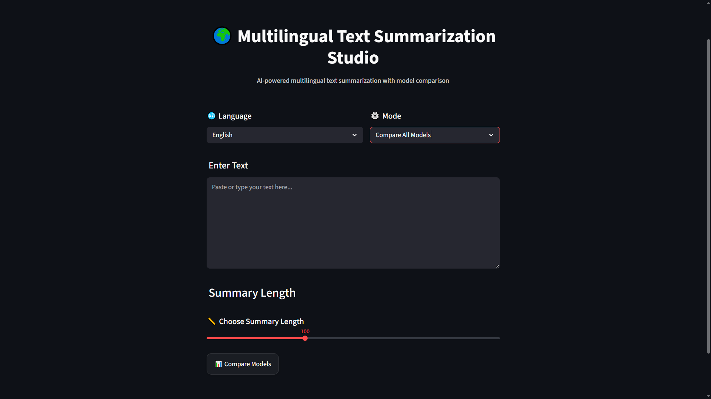
    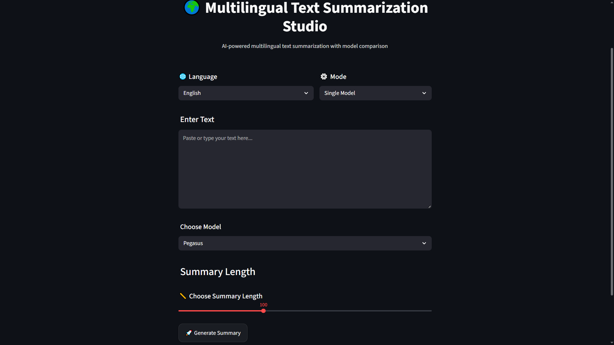
</p>

<!--  -->

---

## 🧠 Model Summarization


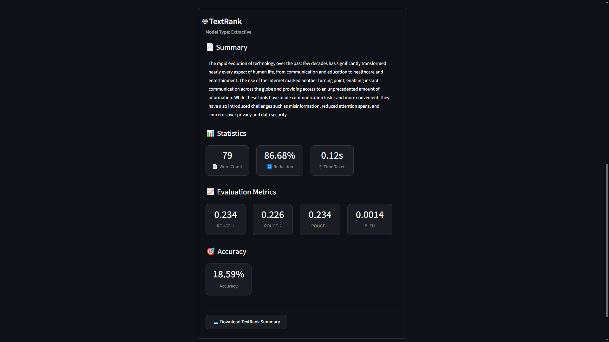

---

## 🤖 AI Model Execution

<p align="center">
    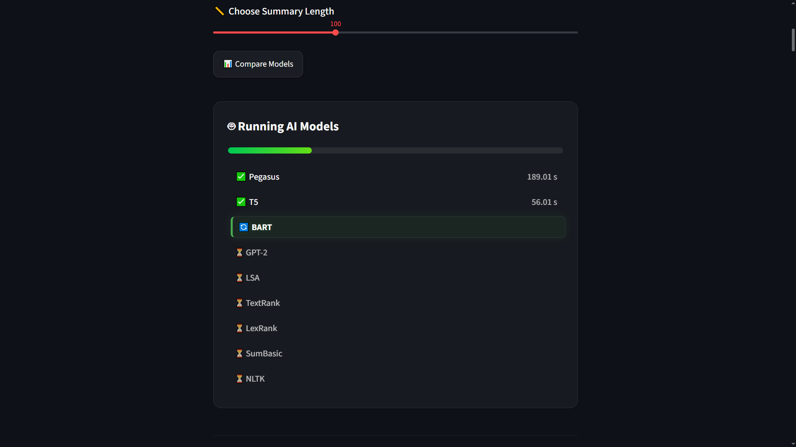
    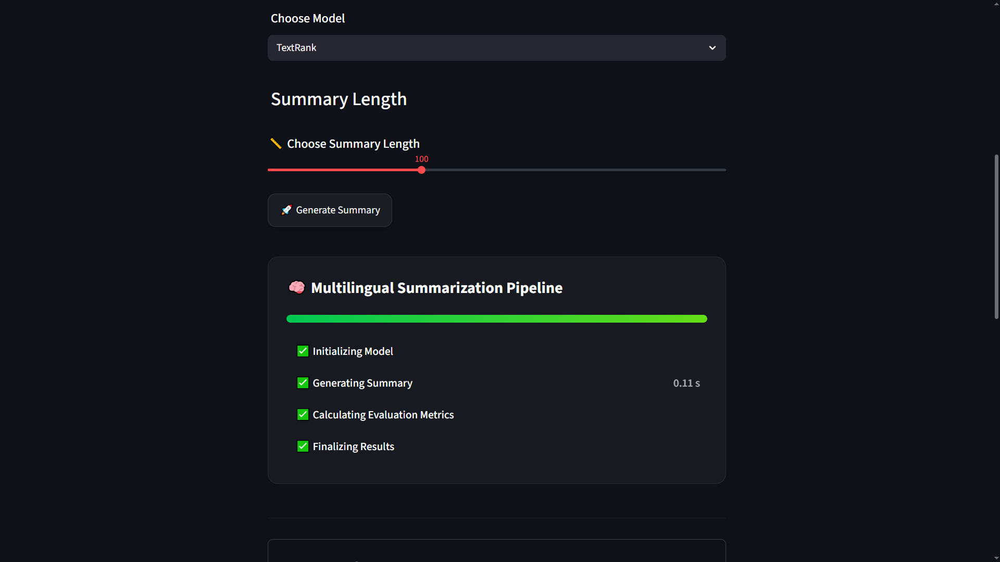
</p>

---

## 📊 Model Comparison

<p align="center">
    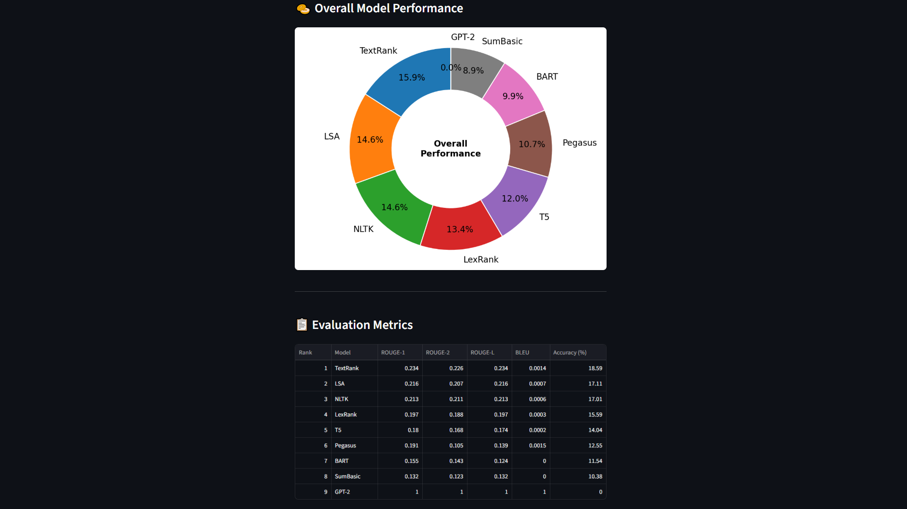
    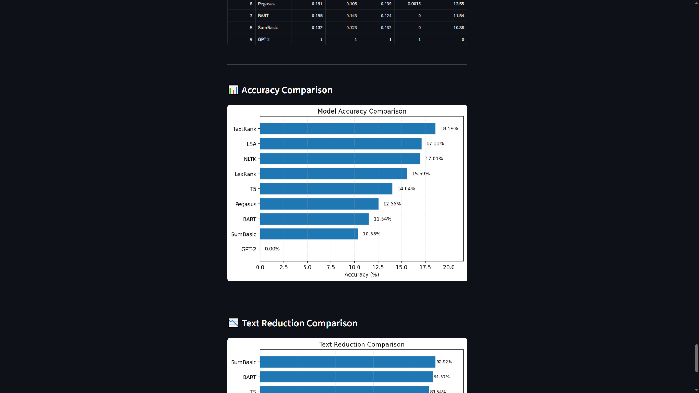
    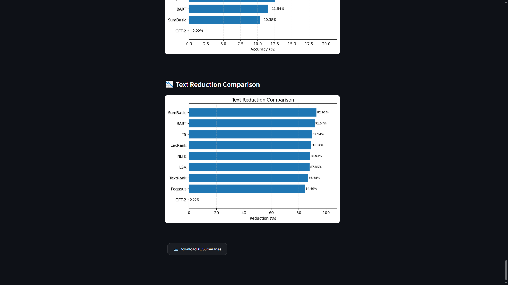
</p>

---

## 🏆 Best Performing Model


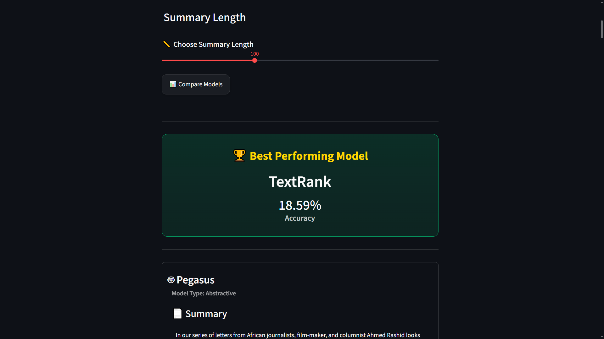


---

## 📝 Winning Summary Generated

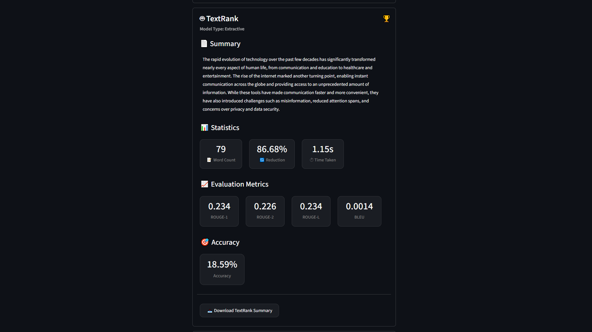

---

## 📝 Single Model Generated Summary

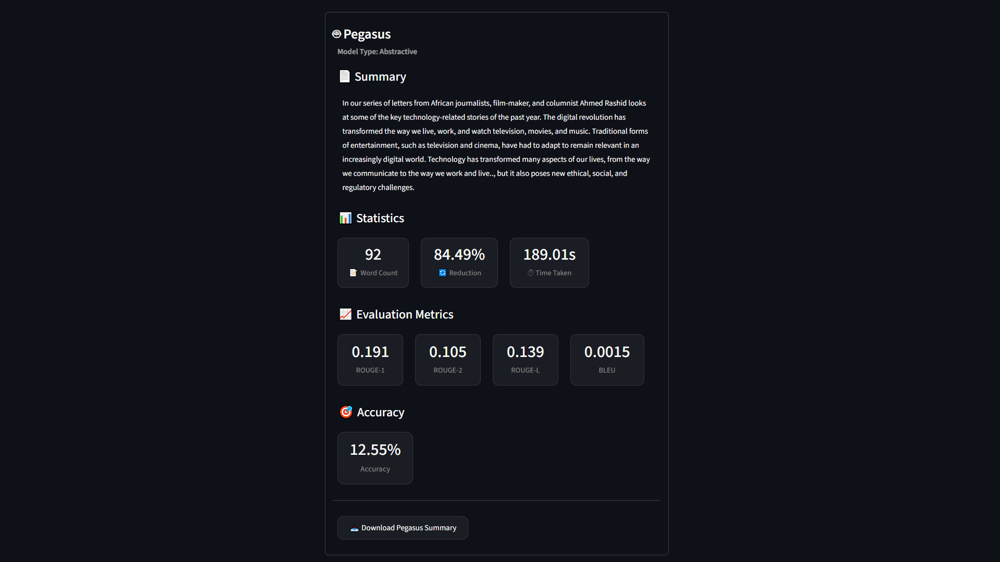

---

## 📝 Summaries Downloaded

<p align="center">
    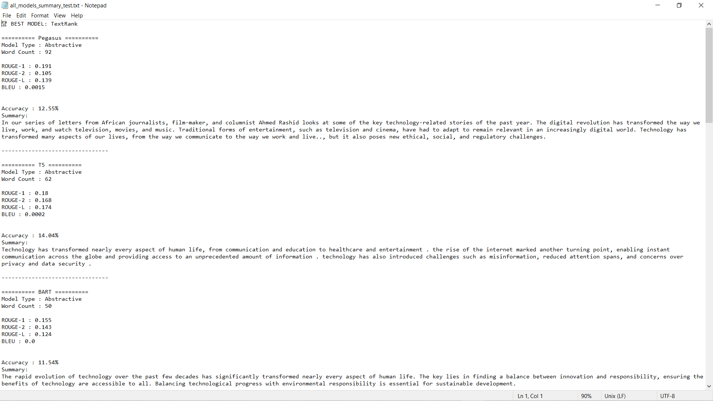
    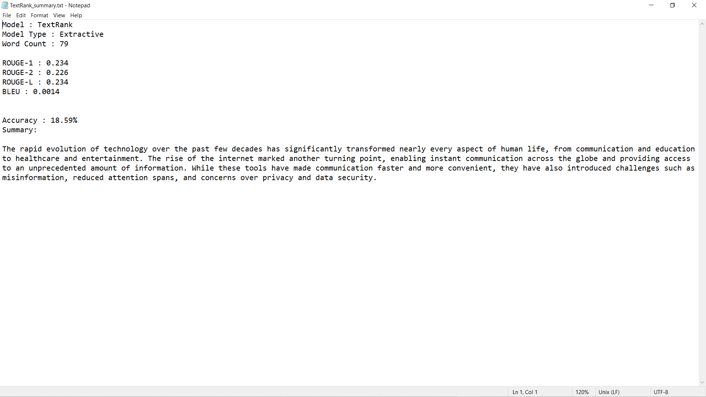
</p>

---


# 📑 Table of Contents

- Overview
- Key Features
- Application Preview
- Technologies Used
- Models Used
- Pre-trained Models
- Evaluation Metrics
- Project Structure
- Installation
- Usage
- Workflow
- Future Enhancements
- Contributors
- License
- Acknowledgements

---

# 🛠 Technologies Used

The project integrates modern NLP libraries, machine learning frameworks, and interactive visualization tools to provide an end-to-end multilingual text summarization experience.

| Category | Technologies |
|----------|--------------|
| **Programming Language** | Python 3.10+ |
| **Web Framework** | Streamlit |
| **Deep Learning Framework** | PyTorch |
| **NLP Library** | Hugging Face Transformers |
| **Traditional NLP** | NLTK |
| **Evaluation Metrics** | ROUGE, BLEU (NLTK) |
| **Data Processing** | Pandas, NumPy |
| **Visualization** | Matplotlib |
| **Version Control** | Git & GitHub |

---

# 🧠 Summarization Models

The application combines both **Transformer-based abstractive summarization** and **traditional extractive summarization** techniques.

## 🇬🇧 English Models

| Model | Type | Category | Description |
|------|------|----------|-------------|
| Pegasus | Transformer | Abstractive | Optimized specifically for abstractive text summarization |
| BART | Transformer | Abstractive | Context-aware encoder-decoder summarization model |
| T5 | Transformer | Abstractive | Text-to-Text Transfer Transformer |
| GPT-2 | Transformer | Generative | Decoder-only language model used as a generative summarization baseline |
| LSA | Statistical | Extractive | Latent Semantic Analysis based summarization |
| TextRank | Graph-based | Extractive | Sentence ranking using graph centrality |
| LexRank | Graph-based | Extractive | Graph-based sentence similarity algorithm |
| SumBasic | Frequency-based | Extractive | Word frequency based summarization |
| NLTK Extractive | Statistical | Extractive | Sentence scoring using Natural Language Toolkit |

---

## 🌍 Multilingual Models

| Model | Type | Supported Languages |
|------|------|----------------------|
| mT5 XL-Sum | Transformer | English, Hindi, Bengali |
| mT5 Small | Transformer | English, Hindi, Bengali |

---

# 🤗 Hugging Face Pre-trained Models

The application utilizes publicly available state-of-the-art pre-trained transformer models from the Hugging Face ecosystem.

| Hugging Face Model | Purpose |
|--------------------|---------|
| google/pegasus-xsum | English Abstractive Summarization |
| facebook/bart-large-cnn | English Abstractive Summarization |
| t5-base | English Text-to-Text Summarization |
| gpt2 | Generative Summarization Baseline |
| csebuetnlp/mT5_multilingual_XLSum | Hindi & Bengali Summarization |
| google/mt5-small | Lightweight Multilingual Summarization |

---

# 📊 Evaluation Metrics

Each generated summary is automatically evaluated using multiple quality and performance metrics.

## ROUGE Metrics

- **ROUGE-1** – Measures unigram overlap between the generated summary and the source text.
- **ROUGE-2** – Measures bigram overlap.
- **ROUGE-L** – Measures the longest common subsequence similarity.

---

## BLEU Score

BLEU evaluates the similarity between the generated summary and the original text by measuring n-gram precision.

---

## Execution Time

Measures the total inference time required by each summarization model.

---

## Compression Ratio

Indicates how much the generated summary has reduced the original document length.

---

## Model Quality Score

The application computes an overall quality score using evaluation metrics to rank English summarization models.

For multilingual summarization, a dedicated multilingual quality score is used to compare generated summaries.

---

# 📂 Project Structure

```text
Text Summarizer/
│
├── .venv/
├── venv/
│
├── Models/
│   ├── __pycache__/
│   ├── __init__.py
│   ├── bart_model.py
│   ├── pegasus_model.py
│   ├── t5_model.py
│   ├── gpt2_model.py
│   ├── lsa_model.py
│   ├── textrank_model.py
│   ├── lexrank_model.py
│   ├── sumbasic_model.py
│   ├── nltk_model.py
│   ├── xlsum_mt5_model.py
│   └── mt5_small_model.py
│
├── Utils/
│
├── Screenshots/
│
├── app.py
├── appTest.py
├── requirements.txt
├── README.md
├── .gitignore
└── screenshot_mode.py
```

---

# 🏗 Architecture

```text
                User Input
                     │
                     ▼
         Language & Model Selection
                     │
                     ▼
           Text Preprocessing
                     │
                     ▼
       Selected Summarization Model
                     │
                     ▼
          Summary Generation
                     │
                     ▼
        Evaluation & Scoring
                     │
                     ▼
      Comparison Dashboard & Charts
```

---

# ⚙ Installation

Follow these steps to set up the project locally.

## 1️⃣ Clone the Repository

```bash
git clone https://github.com/<your-username>/Multilingual-Text-Summarization-Studio.git
```

---

## 2️⃣ Navigate to the Project Directory

```bash
cd Multilingual-Text-Summarization-Studio
```

---

## 3️⃣ Create a Virtual Environment (Optional)

```bash
python -m venv .venv
```

Activate the virtual environment.

**Windows**

```bash
.venv\Scripts\activate
```

**Linux / macOS**

```bash
source .venv/bin/activate
```

---

## 4️⃣ Install Dependencies

```bash
pip install -r requirements.txt
```

---

## 5️⃣ Run the Application

```bash
streamlit run app.py
```

The application will open automatically in your default web browser.

By default, Streamlit runs on:

```text
http://localhost:8501
```

---

# 🚀 How to Use

Using the application is simple and intuitive.

### Step 1

Choose the language.

- 🇬🇧 English
- 🇮🇳 Hindi
- 🇧🇩 Bengali

---

### Step 2

Choose the summarization mode.

- 🧠 Single Model
- 🤖 Compare Models

---

### Step 3

Select the desired summarization model (Single Model mode only).

---

### Step 4

Paste or type the input text.

---

### Step 5

Choose the desired summary length.

- Short
- Medium
- Long

---

### Step 6

Click **Generate Summary** or **Compare Models**.

The application will automatically:

- Generate summaries
- Evaluate the generated summaries
- Calculate ROUGE metrics
- Compute BLEU score
- Measure execution time
- Calculate compression ratio
- Rank model performance
- Display interactive charts

---

# 🔄 Application Workflow

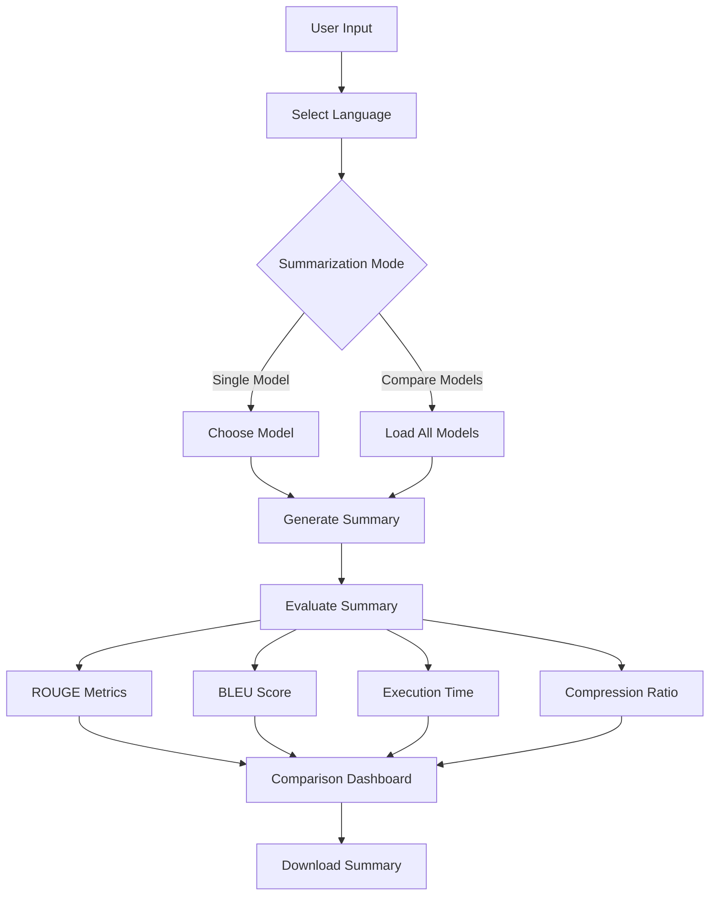

---

# 📈 Future Enhancements

The project can be further improved with several additional capabilities.

### 📄 Document Support

- PDF Summarization
- DOCX Summarization
- PowerPoint Summarization

---

### 🌐 Web Support

- Website Summarization
- URL Summarization
- News Article Summarization

---

### 🤖 AI Enhancements

- Fine-tuned Custom Models
- Retrieval-Augmented Generation (RAG)
- Large Language Model Integration
- Adaptive Summary Length
- Custom Prompt-based Summarization

---

### ☁ Deployment

- Docker Support
- Cloud Deployment
- REST API
- User Authentication
- Database Integration

---

# 👨‍💻 Authors

**Kaustav Das**

B.Tech in Computer Science & Engineering

Techno India University, West Bengal

---

# 🙏 Acknowledgements

The project makes use of several outstanding open-source technologies and publicly available pre-trained models.

Special thanks to:

- Hugging Face
- Streamlit
- PyTorch
- NLTK
- The Python Community
- OpenAI (for development assistance)

---

# 📄 License

This project was developed for academic and educational purposes as part of the **Bachelor of Technology (B.Tech) Final Year Project**.

The project is intended solely for learning, research, and demonstration purposes.

---

<div align="center">

### ⭐ If you found this project useful, consider giving it a star!

Made with ❤️ using Python, Streamlit and Hugging Face Transformers.

</div>